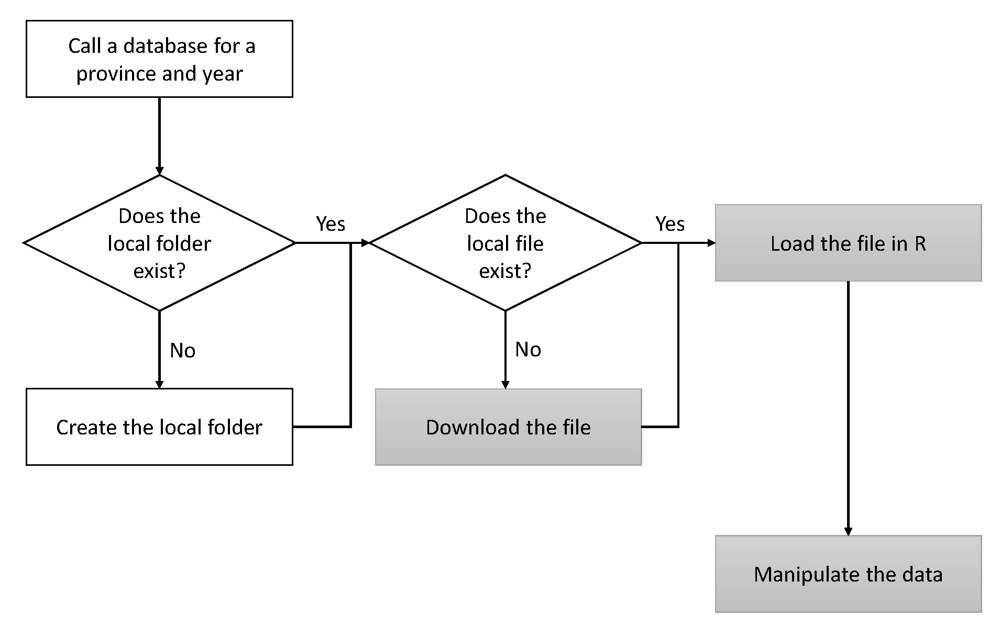

```{r setup, include=FALSE}
knitr::opts_chunk$set(eval=TRUE, FALSE, echo=TRUE, encoding="UTF-8")
```

## 1. Introduction

The DataSpa package provides several databases on population, unemployment, vehicle fleet and firms in Spain at the municipality level (LAU), information to which access is limited and problematic. The package supports different strategies based on URL parsing, PDF text extraction and web scraping through a set of functions built into the R package. Some knowledge of DataSpa is recommended for use of this package, which is available free of charge from the site https://github.com/amvallone/DataSpa.

Population variables for the Spanish municipalities are provided by Spain’s National Statistics Office (INE) website, with certain access barriers. The URL parsing functions of the DataSpa package enable the construction of several databases on population for the full set of over 8000 municipalities and different categories (population by sex, age group and nationality). Fig. 1 presents the general workflow of this URL parsing functionality designed for the databases on population and unemployment in Spain.



## 2. URL parsing functions

### 2.1. Download function: `getbase.pob()`

This function enables downloading of the 52 individual province files of the **municipality population** from the INE website (“Padrón de Habitantes”). These files are stored as ‘xlsx’ Excel files in the folder named ‘data_poblacion’, which is created in the working directory. It is a useful function for  **users interested only in downloading the individual province files** (e.g., to work with them separately in any other software).

To download these files, you must first install and load the package "DataSpa":
```{r message=FALSE, warning=FALSE, include=FALSE}
devtools::install_github("amvallone/DataSpa")
library(DataSpa)
``` 

Next, a vector with the province names should be defined:
```{r, eval=TRUE, message=FALSE, warning=FALSE}
prov<-c("ALBACETE","ALICANTE","ALMERIA","ARABA","ASTURIAS",
       "AVILA","BADAJOZ","BALEARES","BARCELONA","BIZKAIA",
       "BURGOS","CACERES","CADIZ","CANTABRIA","CASTELLON",
       "CIUDAD REAL","CORDOBA","A CORUÑA","CUENCA",
       "GIPUZKOA","GIRONA","GRANADA","GUADALAJARA","HUELVA",
       "HUESCA","JAEN","LEON","LLEIDA","LUGO","MADRID","MALAGA",
       "MURCIA","NAVARRA","OURENSE","PALENCIA","LAS PALMAS",
       "PONTEVEDRA", "LA RIOJA","SALAMANCA","TENERIFE",
       "SEGOVIA","SEVILLA","SORIA","TARRAGONA","TERUEL",
       "TOLEDO","VALENCIA","VALLADOLID","ZAMORA","ZARAGOZA",
       "CEUTA","MELILLA")
``` 

Finally, `getbase.pob()` function downloads the 52 Excel files to the ‘data_poblacion’ folder. For example, the population data for 2017 can be downloaded as follows:
```{r message=FALSE, warning=FALSE, include=FALSE}
sapply(prov,getbase.pob,2017)
``` 

### 2.2. Loading function: `pob.tot()`

This function enables loading to R of the 52 Excel files previously downloaded from INE and stored in the ‘data_poblacion’ folder. If necessary, it can also call the `getbase.pob()` function to download the Excel files. Additionally, it creates a unique data frame with the population database. For example, for the 2017 population database.

```{r message=FALSE, warning=FALSE, include=FALSE}
pob17t <- data.frame()
for (i in seq_along(prov)){
  print(i)
  data <- pob.tot(2017,prov[i])
  pob17t <- rbind(pob17t,data)
}
```

Since the 52 province aggregates are also included, they must be removed in order to obtain a data frame. This data frame contains the population variable, in one column, for the set of Spanish municipalities, in rows:

```{r, eval=TRUE,echo=TRUE}
pob17<-pob17t[pob17t$Cod != 'Total', ]
colnames(pob17)[3] <- "POB17"

``` 

### 2.3. Exportation of the population database 

The programme also permits exportation of the municipality population database in text format:
```{r, eval=TRUE,echo=TRUE}
write.table(pob17, "pob17.txt", sep="\t")
```

## 3. Analysis of population by municipality

We can obtain the basic descriptive statistics of the total population of Spanish municipalities in 2017:

```{r}
summary(pob17$POB17)
```

As shown by the q-q plot, this is a highly right-skewed variable due to the heterogeneity of Spanish municipalities: in addition to a large set of small villages (61%) with fewer than 1,000 inhabitants, there are only 62 big cities over 100,000 inhabitants, among which are the megalopolises of Madrid and Barcelona.

```{r, message=FALSE, warning=FALSE, echo=FALSE}
library(qqplotr)
library(gridExtra)
qqnorm(pob17$POB17,ylab ="Municipality Population",
  col = "red",
  main="Normal Q-Q plot, Spanish Population, 2017");
qqline(pob17$POB17)
```

In order to avoid this size effect, it is advisable to transform the municipality population into logarithms. For example:

```{r, message=FALSE, warning=FALSE, echo=FALSE}
par(mfrow=c(1,2))
lpob17<-log(pob17$POB17)
qqnorm(lpob17,ylab ="Municipality Population (log)",
       col="green",
       main="Normal Q-Q plot");
qqline(lpob17)
hist(lpob17, breaks=12, col="lightblue",
     xlab="Population, 2017", ylab="# municipalities",
     main="Histogram")
```

Spatial representation of this variable on a map shows a multicentric structure of the Spanish population across municipalities, with a significant core around the city of Madrid and along the coasts.

```{r, message=FALSE, warning=FALSE, echo=FALSE}
require(ggplot2)
muni17 <- openxlsx::read.xlsx("Muni17.xlsx", 1)
muni17$CODE <- as.character(muni17$CODE) # Convert formats
muni17$XLON<-as.numeric(as.character(muni17$XLON))
muni17$YLAT<-as.numeric(as.character(muni17$YLAT))
colnames(pob17)[1] <- "CODE" # Change column names
pob17<-subset(pob17,select=c(CODE,POB17)) # Delete "Municipio"
muni17<-merge(x=muni17,y=pob17,
              by.x=c("CODE"),by.y=c("CODE"),all.y=TRUE)
mp17<-ggplot(muni17,aes(x=XLON,y=YLAT,color=log(POB17))) +
  geom_point(size=2) +
  labs(subtitle="Spain, 2017",y="Latitude (North)",
       x="Longitude (West)",
       title="Municipality Population (in logs)",
       caption="Source: INE")
mp17+scale_color_gradient(low="yellow",high="black") +
  theme_bw() + 
  theme(axis.title=element_text(face="bold.italic",
  size="12", color="brown"), legend.position="right")

```

